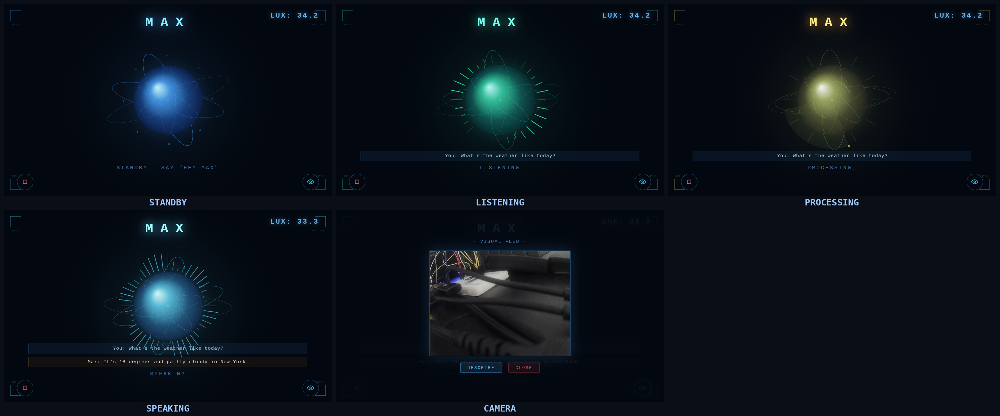

# Max

A voice assistant for Raspberry Pi 5. Runs Whisper, qwen3, and Piper locally.
Uses Gemini Flash for vision when an API key is set.



## What it does

Wake on "Hey Max", listen, transcribe, talk back. Camera button captures
a frame and describes it. Voice commands like "turn on the light" toggle
the LED on GPIO17. Reads ambient light from a BH1750 and asks if you
want the light on when the room gets dark. Pulls weather from
Open-Meteo when you ask about it.

The browser UI shows the assistant state, mouth animation, transcript,
and a live camera preview.

## Hardware

- Raspberry Pi 5 (8 GB)
- USB microphone
- USB webcam (UVC)
- BH1750 on I²C bus 1, address 0x23 (SDA=GPIO2, SCL=GPIO3)
- LED on GPIO17 with a 220Ω resistor
- HDMI display and speakers

## Install

```bash
git clone <repo>
cd voice-assistant
python3 -m venv .venv
source .venv/bin/activate
./setup.sh
```

Enable I²C if it's off:

```bash
echo "dtparam=i2c_arm=on" | sudo tee -a /boot/firmware/config.txt
sudo reboot
```

For cloud vision, set the key in your shell:

```bash
export GEMINI_API_KEY="..."
```

## Run

```bash
.venv/bin/python main.py
```

Say "Hey Max" to wake it up. "clear" or "reset" wipes the conversation
history. Ctrl+C to quit.

## License

MIT
